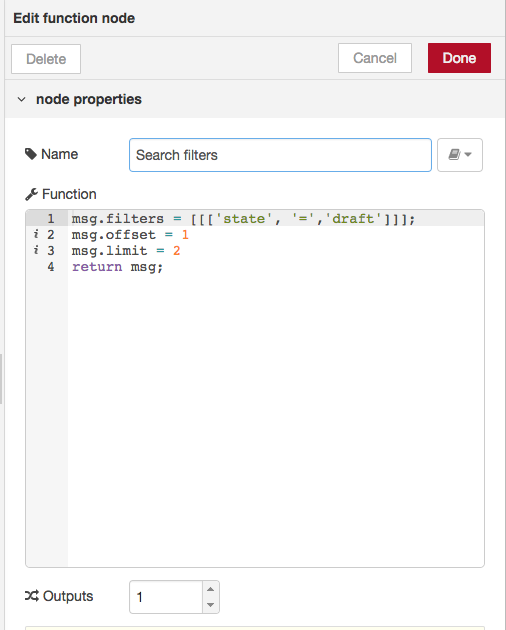
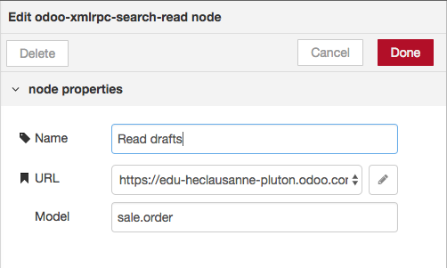
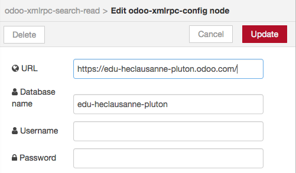

# node-red-contrib-odoo-xmlrpc

A set of nodes for making calls to the Odoo XML-RPC API.

## Installation

Assuming that you have [Node-RED](nodered.org) already installed.

__NOTE:__
As of now, you cannot install this module directly from the palette of Node-RED.

## macOS and Linux
From your terminal:

```bash
# Go to the folder where your Node-RED plugins would be installed.
cd ~/.node-red

# Install the plugin using the following command
npm install https://github.com/BatikhSouri/node-red-contrib-odoo-xmlrpc
```

## Windows
From cmd:

```bash
# Go to the folder where your Node-RED plugins would be installed. Create it if it doesn't exist
cd %userprofile%
mkdir .node-red
cd .node-red

# Install the plugin using the following command
npm install https://github.com/BatikhSouri/node-red-contrib-odoo-xmlrpc
```

__What if a message "No git binary found in $PATH" appears?__

Well, you'd need to [download and install git](https://git-scm.com/downloads). You might then need to close & re-open your terminal.

__What if I already installed the original node-red-contrib-odoo-xmlrpc module?__

1. Export your existing flows
2. Stop the Node-RED application/server
3. Run the install steps above
4. Start the Node-RED application again
5. Load/create your flows, if necessary

That should be it.

## Usage

Documentation of each node is found in the "info" tab in the Node-RED Flow editor.

See [Odoo Web Service API](https://www.odoo.com/documentation/11.0/webservices/odoo.html) for more information.

## Example

Still, if you are new to Node-RED or Odoo, here is a simple example showing you how to read quotes/draft invoices and logging them to the debug tab of Node-RED:


__First node:__
The first node is an "inject" node, that will be used to trigger/start the Flow

__Second node:__
The second node is a "function" node, that we will used to specify conditions in our Odoo query (by adding attributes to the `msg` object). In this example, we wrote a function (see screenshot below) to filter Odoo records and keep only invoice drafts (first line of the function; format is described in the [Odoo documentation](https://www.odoo.com/documentation/11.0/webservices/odoo.html#list-records)). We also specified that we want to skip the first result from the answer (second line of the function), and that we want to keep only 2 records afterwards. At the end, don't forget to `return msg` to pass along your query settings to the next node. Note that this node is not necessary, but rather useful if you want to perform precise searches on Odoo's data. Each of `msg.filters`, `msg.offset` and `msg.limit` are optional parameters.



__Third node:__
The third node is a "odoo-xmlrpc-search-read" node, that actually sends the query to Odoo and waits for a response. You have specify the Odoo connection settings (the "pencil" button) and the data model from which you want to read (in this example: `sale.order`)



Connection settings:



__Fourth node:__
The fourth node is a simple "debug" node, that will by default write the contents of `msg.payload` (which, in this case and at this stage, will be the response from the previous "odoo-xmlrpc-search-read" node)

## Note

This is currently still a work in progress. As you may see not all the API functionality has been covered yet.

Patches welcome.

Orignally written by Ross Golder. Improved by Ahmad Benmrad.
